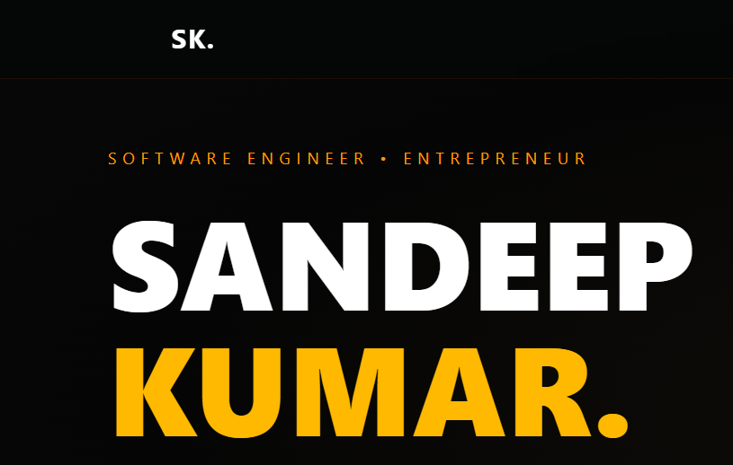
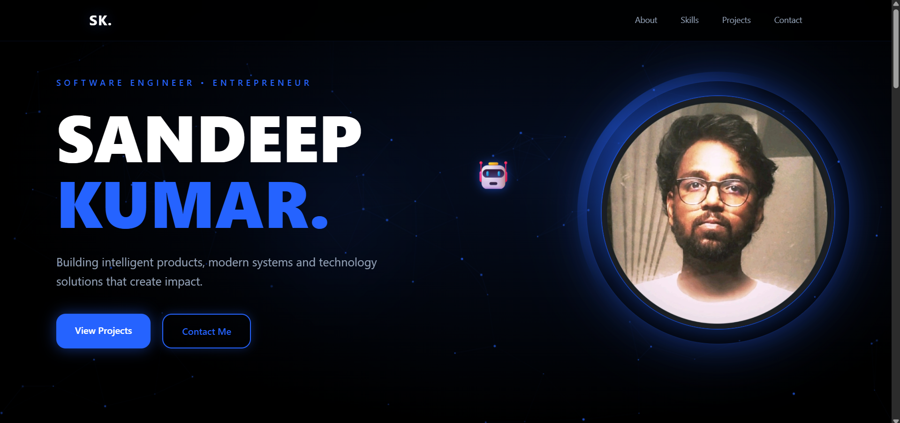
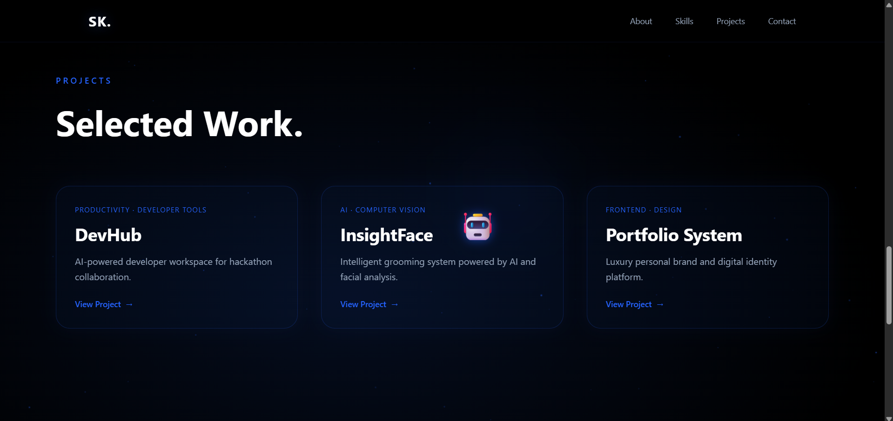
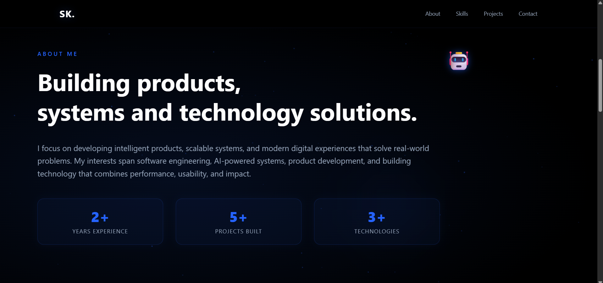

# 🚀 Portfolio System

A modern, high-performance developer portfolio engineered to showcase projects, skills, engineering personality, and technical capability with premium UI/UX design.

Built for developers who want more than a template.

<p align="center" style="margin: 60px 0;">
  
</p>

---

# ✨ Features

- ⚡ Modern responsive UI
- 🎨 Premium dark theme design
- 🚀 Smooth animations & transitions
- 🧠 Clean component architecture
- 📱 Fully responsive across devices
- 🌐 Social media integration
- 📂 Dynamic projects showcase
- 💻 Developer-focused branding
- 🔥 Fast performance optimization

---

# 🛠 Tech Stack

## Frontend

- Next.js
- React.js
- Tailwind CSS
- TypeScript
- Framer Motion

## Deployment

- Vercel
- Netlify
- Cloudflare Pages

---

# 📁 Folder Structure

```bash
portfolio/
│
├── public/
│   ├── screenshots/
│   └── assets/
│
├── src/
│   ├── app/
│   ├── components/
│   ├── sections/
│   ├── data/
│   ├── styles/
│   └── utils/
│
├── package.json
├── tailwind.config.js
├── tsconfig.json
└── README.md
```

---

# ⚙️ Installation & Setup

## 1️⃣ Clone Repository

```bash
git clone https://github.com/sandeep-x47/Portfolio-System.git
```

---

## 2️⃣ Navigate to Project

```bash
cd portfolio
```

---

## 3️⃣ Install Dependencies

```bash
npm install
```

---

## 4️⃣ Run Development Server

```bash
npm run dev
```

---

## 5️⃣ Open Browser

```bash
http://localhost:3000
```

---

# 🚀 Available Scripts

```bash
npm run dev      # Start development server
npm run build    # Production build
npm run start    # Run production server
npm run lint     # Run ESLint
```

---

# 📸 Screenshots

## 🖥 Landing Page



---

## 🚀 Projects Section



---

## 👨‍💻 About Section



---

# 🧠 Philosophy Behind This Project

Most developer portfolios fail because they:

- Look template-generated
- Have weak presentation
- Lack engineering personality
- Feel visually outdated
- Provide zero differentiation

This project was engineered to solve that.

## 🎯 The Goal

Create a portfolio that feels like a premium product.

Because perception matters.

Recruiters judge in seconds.  
Founders judge instantly.

Your portfolio should create authority, credibility, and technical presence.

---

# 🔥 Planned Features

- 🤖 AI-powered portfolio assistant
- 🌐 CMS integration
- 📊 Visitor analytics dashboard
- 📝 Technical blogging engine
- 🎭 Dynamic theme system
- 🧠 Personalized content experience
- 🎨 Interactive 3D sections

---

# 🌍 Deployment

Deploy instantly using:

- ▲ Vercel
- ☁️ Netlify
- 🌐 Cloudflare Pages

---

# 📄 License

Licensed under the MIT License.

---

# 👨‍💻 Author

## Sandeep Kumar

Software Engineer • AI Builder • Full Stack Developer

📍 Chennai, India

---

# 🌐 Connect With Me

<p align="left">

<a href="https://github.com/sandeep-x47" target="_blank">
  
</a>

<a href="https://www.linkedin.com/in/sandeep-kumar-b7a8012bb/" target="_blank">
  
</a>

<a href="https://www.instagram.com/x.sandeepkumar" target="_blank">
  
</a>

<a href="https://x.com/Sandeep_X47" target="_blank">
  
</a>

</p>

---

# ⭐ Support The Project

If you found this project useful:

- ⭐ Star the repository
- 🍴 Fork the project
- 🚀 Build your own version
- 🧠 Improve the system

---


Because strong developers do not just build systems.

They present them properly.
